# ResumeAlter — Technical Documentation

> **AI-Powered Resume Tailoring Platform** — Automatically tailor resumes to match job descriptions, maximize ATS scores, generate cover letters, and track applications.

---

## Table of Contents

1. [Tech Stack](#tech-stack)
2. [System Architecture](#system-architecture)
3. [Database Schema (ERD)](#database-schema)
4. [LLM Flow — The AI Pipeline](#llm-flow)
5. [Sequence Diagrams](#sequence-diagrams)
6. [Lean Specifications](#lean-specifications)
7. [Technical Paper](#technical-paper)

---

## Tech Stack

| Layer | Technology | Purpose |
|-------|-----------|---------|
| **Framework** | Next.js 16 (App Router) | Full-stack React framework with SSR/RSC |
| **Language** | TypeScript | Type-safe frontend & backend |
| **UI** | React 19, Tailwind CSS 4, Radix UI | Component library with accessibility |
| **AI (Primary)** | Google Gemini API (`@google/generative-ai`) | LLM for tailoring, analysis, parsing |
| **AI (Local)** | Ollama (Llama 3.1) | Self-hosted LLM alternative |
| **AI (Custom)** | Any OpenAI-compatible API | Bring-your-own-model support |
| **Database** | SQLite (dev) / Turso libSQL (prod) | Embedded → Edge-ready SQL |
| **ORM** | Drizzle ORM | Type-safe SQL queries |
| **Auth** | NextAuth v5 (Credentials) | Session-based authentication |
| **Scraping** | Cheerio + Axios | Server-side JD extraction |
| **PDF** | pdf-parse (input), jsPDF + html2canvas (output) | Resume import & export |
| **State** | React Context (`AIConfigContext`, `ParseContext`) | Client-side state management |
| **Styling** | Inter (Google Fonts), Lucide icons, Sonner toasts | Design system |
| **Deployment** | Vercel / Node.js | Serverless or traditional hosting |

---

## System Architecture

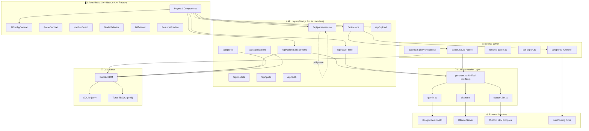

### Component Architecture

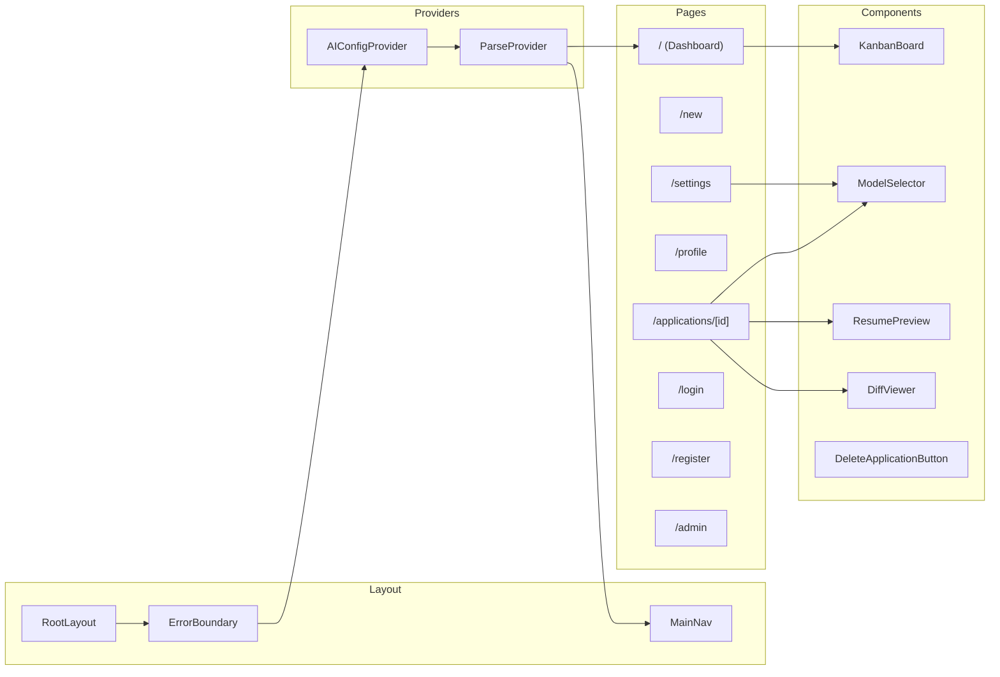

---

## Database Schema

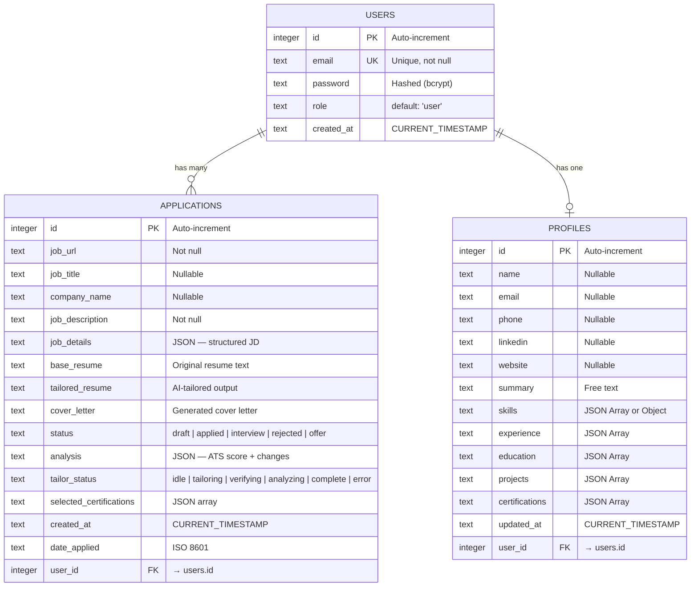

---

## LLM Flow

The core intelligence of ResumeAlter is a **5-phase AI pipeline** executed via Server-Sent Events (SSE) streaming. Each phase uses the unified `generateText()` abstraction layer.

### LLM Provider Abstraction

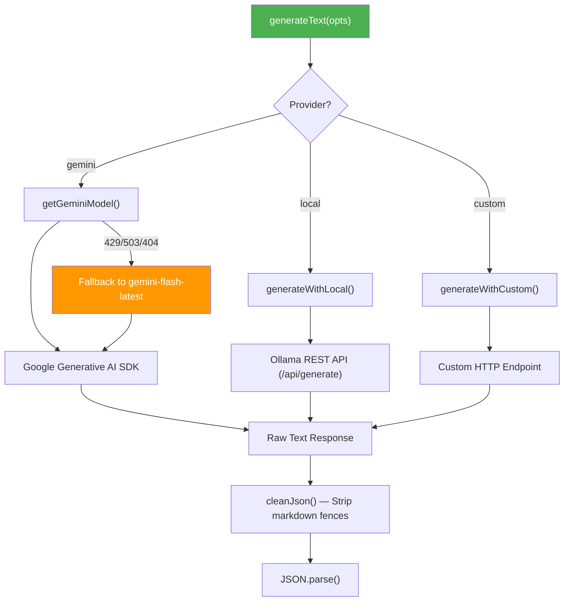

### The 5-Phase Tailoring Pipeline

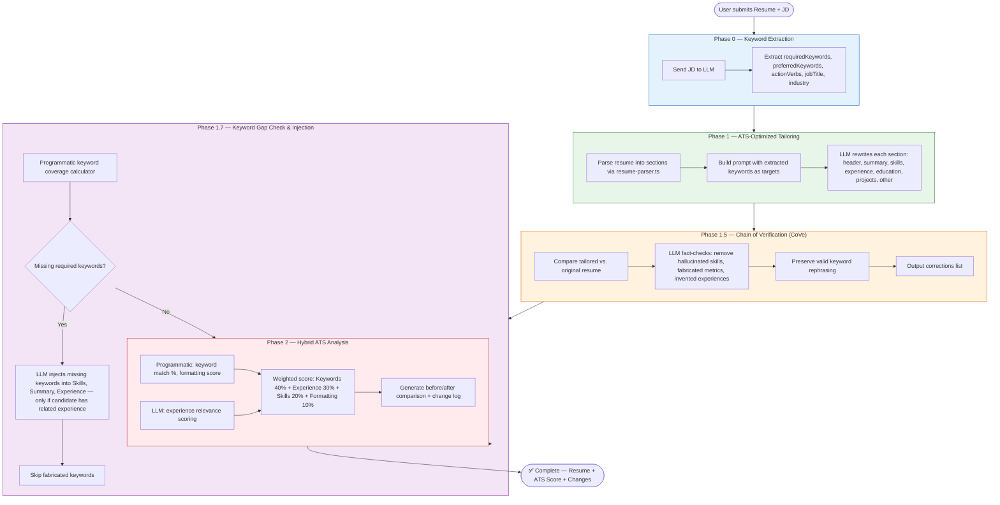

### Cover Letter Generation Flow

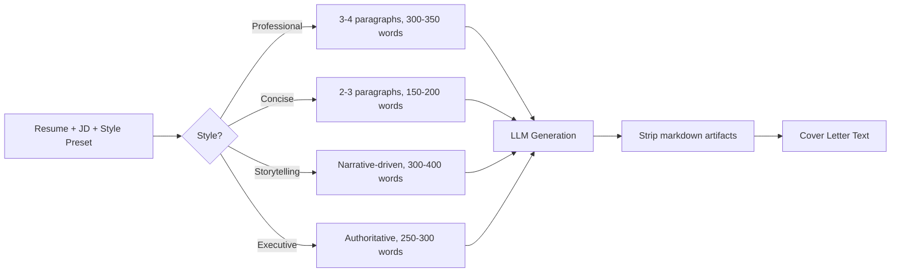

---

## Sequence Diagrams

### 1. Resume Tailoring Flow (Main Pipeline)

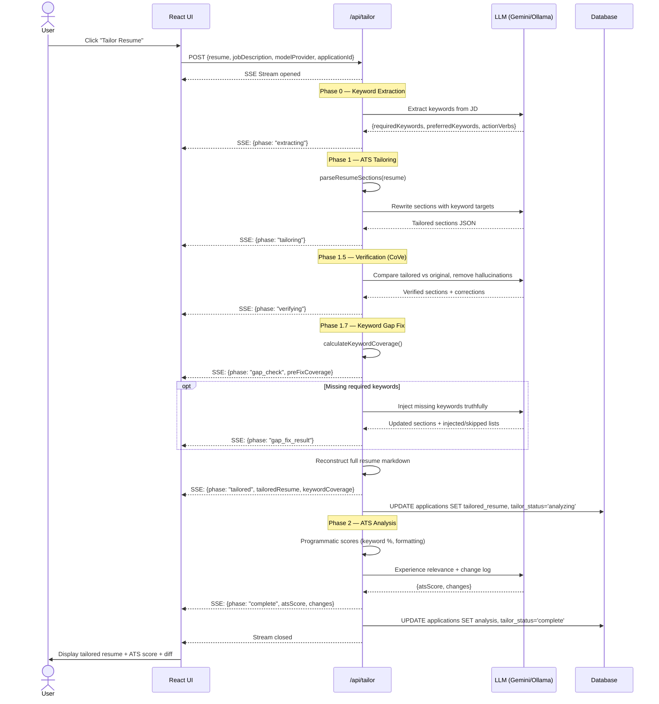

### 2. New Application Creation Flow

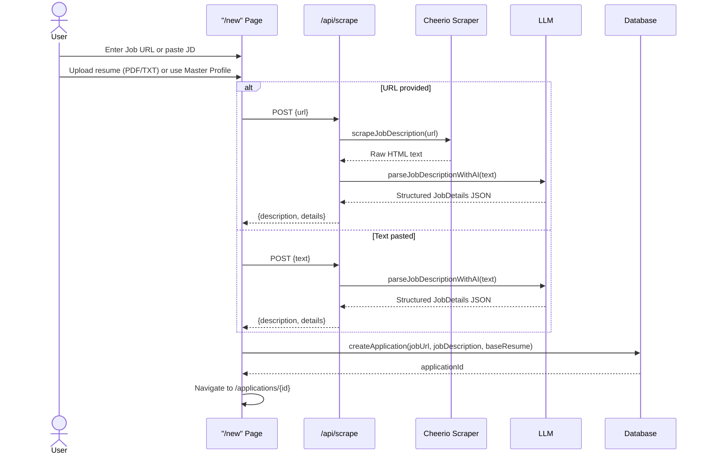

### 3. Authentication Flow

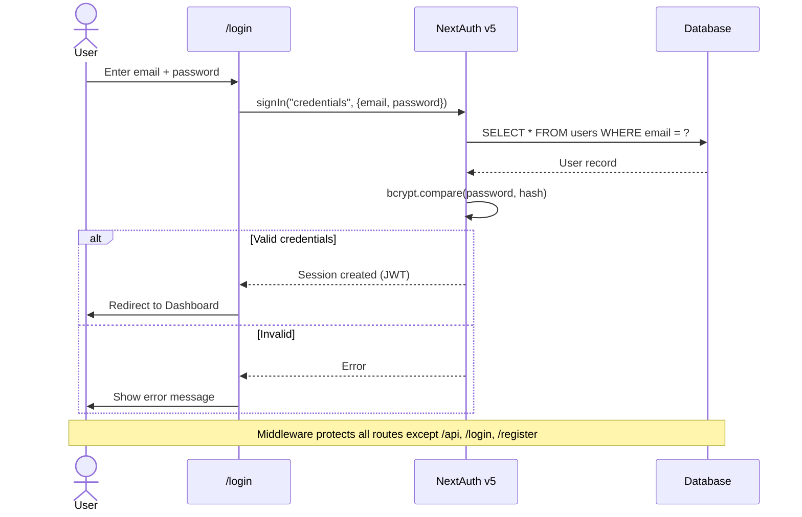

### 4. PDF Export Flow

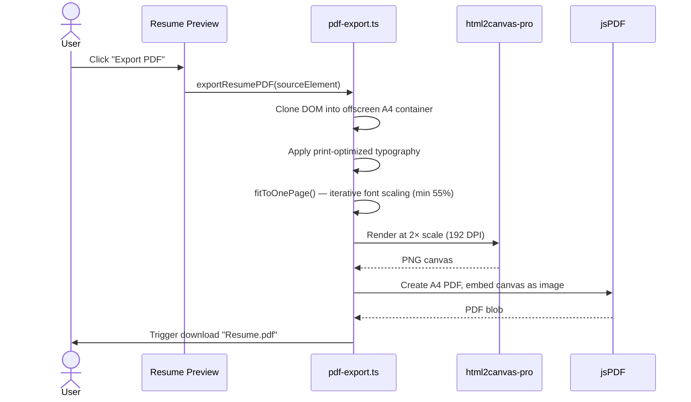

### 5. Cover Letter Generation

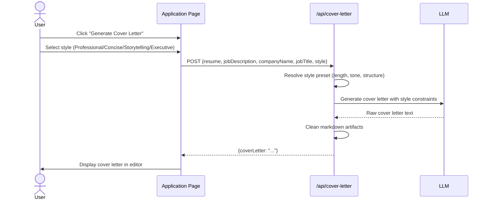

---

## Lean Specifications

### Product Vision

**ResumeAlter** is an AI-powered resume optimization platform that helps job seekers tailor their resumes to specific job descriptions, maximizing their chances of passing Applicant Tracking Systems (ATS).

### Problem Statement

- Job seekers send the **same generic resume** to every job, resulting in low ATS scores
- Manually tailoring resumes is **time-consuming** (30-60 min per application)
- Most applicants **don't understand** what ATS systems scan for
- No way to **track** which version of a resume was sent where

### Core Value Proposition

| Metric | Before ResumeAlter | After ResumeAlter |
|--------|-------------------|-------------------|
| Time per tailored resume | 30-60 min | 2-3 min |
| ATS keyword match | ~30-50% | ~80-95% |
| Applications tracked | Spreadsheet / none | Kanban board |
| Cover letters | Generic or none | Style-specific, auto-generated |

### User Personas

1. **Active Job Seeker** — Applying to 10-50+ jobs, needs speed and consistency
2. **Career Changer** — Needs help rephrasing experience for new industry keywords
3. **Technical Professional** — Wants precise keyword alignment for engineering roles

### Feature Matrix

| Feature | Status | Priority |
|---------|--------|----------|
| AI Resume Tailoring (5-phase pipeline) | ✅ Shipped | P0 |
| ATS Score Analysis (before/after) | ✅ Shipped | P0 |
| Job Description Scraping (URL) | ✅ Shipped | P0 |
| JD Parsing (AI-structured) | ✅ Shipped | P0 |
| Master Profile (single source of truth) | ✅ Shipped | P1 |
| Cover Letter Generation (4 styles) | ✅ Shipped | P1 |
| Application Tracking (Kanban board) | ✅ Shipped | P1 |
| Resume Diff Viewer | ✅ Shipped | P1 |
| PDF Export (A4, print-optimized) | ✅ Shipped | P2 |
| Multi-model Support (Gemini/Ollama/Custom) | ✅ Shipped | P2 |
| User Auth (email/password) | ✅ Shipped | P0 |
| Admin Panel | ✅ Shipped | P3 |
| Quota Health Check | ✅ Shipped | P3 |

### API Surface

| Endpoint | Method | Purpose |
|----------|--------|---------|
| `/api/tailor` | POST | 5-phase resume tailoring (SSE) |
| `/api/scrape` | POST | Scrape + parse job description |
| `/api/parse-resume` | POST | Extract text from PDF/TXT |
| `/api/cover-letter` | POST | Generate styled cover letter |
| `/api/models` | GET | List available Gemini models |
| `/api/quota` | GET | Health check for API key/quota |
| `/api/applications/[id]/status` | GET/PATCH | Application status management |
| `/api/profile/parse` | POST | Parse profile from uploaded resume |
| `/api/auth/[...nextauth]` | * | NextAuth authentication |
| `/api/upload` | POST | File upload (PDF/TXT) |

---

## Technical Paper

### Abstract

ResumeAlter is a full-stack web application that leverages Large Language Models (LLMs) to automatically tailor resumes to specific job descriptions. The system implements a novel **5-phase AI pipeline** combining keyword extraction, ATS-optimized rewriting, Chain-of-Verification (CoVe) for hallucination prevention, programmatic keyword gap injection, and hybrid deterministic-LLM scoring. The platform supports multiple LLM providers (Google Gemini, Ollama, custom endpoints), uses Server-Sent Events for real-time progress streaming, and provides a complete application tracking workflow.

### 1. Introduction

The modern job market requires candidates to customize their resumes for each position. Applicant Tracking Systems (ATS) filter out 75% of resumes before a human reviewer sees them, primarily through keyword matching algorithms. ResumeAlter addresses this by automating the resume tailoring process with AI while maintaining truthfulness and preventing hallucination.

### 2. Architecture

ResumeAlter follows a **monolithic full-stack architecture** built on Next.js 16 with the App Router pattern:

- **Server Components (RSC)** for initial page loads and data fetching
- **Client Components** for interactive UI (prefixed with `'use client'`)
- **Route Handlers** for API endpoints (stateless, serverless-compatible)
- **Server Actions** for database mutations with automatic revalidation

The database layer uses **Drizzle ORM** with a dual-driver strategy:
- `better-sqlite3` for local development (zero configuration)
- `@libsql/client` for Turso (production edge database)

This allows seamless deployment to Vercel's serverless platform while maintaining fast local development.

### 3. The LLM Abstraction Layer

A unified `generateText()` function abstracts over three LLM providers:

```
Provider Selection Priority:
1. Explicit modelProvider from request body
2. GEMINI_API_KEY present → Gemini
3. CUSTOM_LLM_URL present → Custom
4. Fallback → Local (Ollama)
```

**Gemini Integration** includes automatic model fallback: if the selected model returns 429 (rate limit), 503 (unavailable), or 404 (not found), the system falls back to `gemini-flash-latest`.

All providers normalize their output to raw text strings, with `cleanJson()` handling markdown fence stripping and JSON isolation.

### 4. The 5-Phase Tailoring Pipeline

The core innovation of ResumeAlter is a multi-phase pipeline that balances keyword optimization with factual accuracy:

**Phase 0 — Keyword Extraction**: The job description is analyzed to extract required keywords, preferred keywords, action verbs, job title, and industry. This creates a structured target list for subsequent phases.

**Phase 1 — ATS-Optimized Tailoring**: The resume is parsed into 7 sections (header, summary, skills, experience, education, projects, other) using regex-based heuristics. Each section is rewritten with explicit keyword placement rules:
- Summary must front-load the job title and 3-5 top keywords
- Skills section must use exact JD phrasing
- Experience bullets must weave keywords with STAR method

**Phase 1.5 — Chain of Verification (CoVe)**: A separate LLM call acts as a "Fact-Checker", comparing the tailored resume against the original to eliminate:
- Fabricated skills not in the original resume
- Inflated metrics (e.g., "improved by 20%" becoming "improved by 50%")
- Insertion of the hiring company's name

Importantly, CoVe preserves valid keyword rephrasings (e.g., "Jenkins" → "CI/CD").

**Phase 1.7 — Keyword Gap Check & Injection**: A programmatic `calculateKeywordCoverage()` function identifies missing required keywords. If gaps exist, a targeted LLM call attempts to inject them — but only if the candidate has related experience in the original resume. Keywords without evidence are skipped entirely.

**Phase 2 — Hybrid ATS Analysis**: The final score uses a weighted formula:
- **Keyword Match (40%)**: Programmatic calculation
- **Experience Relevance (30%)**: LLM-assessed
- **Skills Alignment (20%)**: Programmatic calculation
- **Formatting (10%)**: Programmatic check (H1, H2 sections, bullet count)

The hybrid approach prevents the LLM from "hallucinating" ATS scores while still leveraging its ability to assess semantic relevance.

### 5. Real-Time Streaming with SSE

The tailoring endpoint uses **Server-Sent Events (SSE)** via the Web Streams API (`ReadableStream`). Each phase emits structured JSON events:

```
data: {"phase": "extracting"}
data: {"phase": "tailoring"}
data: {"phase": "verifying"}
data: {"phase": "gap_check", "data": {...}}
data: {"phase": "tailored", "data": {"tailoredResume": "...", "keywordCoverage": {...}}}
data: {"phase": "analyzing"}
data: {"phase": "complete", "data": {"atsScore": {...}, "changes": [...]}}
```

This allows the UI to display granular progress (extracting → tailoring → verifying → analyzing → complete) with real-time data updates.

### 6. Security & Authentication

- **NextAuth v5** with Credentials provider
- Passwords hashed with **bcrypt**
- Middleware-based route protection (all routes except `/api`, `/login`, `/register`, static assets)
- Server Actions use `auth()` to verify session before any database operation
- API keys stored server-side in environment variables (never exposed to client)

### 7. PDF Export Engine

The export system implements a **clone-scale-render** strategy:
1. Deep-clone the resume DOM into an offscreen A4 container (718×1047px at 96 DPI)
2. Apply print-optimized typography (Inter font, tighter margins, no shadows)
3. Iteratively shrink font sizes (3% steps, minimum 55% scale) until content fits one page
4. Render at 2× resolution via html2canvas-pro for print-quality output
5. Embed the canvas into a jsPDF A4 document

### 8. Deployment Architecture

```
Development:                    Production (Vercel):
┌─────────────────┐            ┌─────────────────────┐
│  npm run dev    │            │  Vercel Serverless   │
│  localhost:3000 │            │  Edge Functions      │
│                 │            │                      │
│  SQLite (local) │            │  Turso (libSQL)      │
│  sqlite.db      │            │  Global Edge DB      │
│                 │            │                      │
│  .env.local     │            │  Vercel Env Vars     │
└─────────────────┘            └─────────────────────┘
```

### 9. Limitations & Future Work

| Limitation | Possible Solution |
|-----------|------------------|
| JD scraping blocked by some sites | Browser-based extraction or API integrations |
| Single-page PDF only | Multi-page support with section splitting |
| No OAuth providers | Add Google/GitHub/LinkedIn OAuth |
| English-only keyword matching | Multilingual NLP support |
| No resume version history | Git-like versioning for resume iterations |

### 10. Conclusion

ResumeAlter demonstrates that a multi-phase LLM pipeline with programmatic guardrails can reliably optimize resumes for ATS systems while maintaining factual accuracy. The Chain of Verification step and hybrid scoring approach are key innovations that prevent the common LLM failure modes of hallucination and score fabrication. The platform's provider-agnostic LLM abstraction and dual-database strategy ensure it can be deployed flexibly across self-hosted and cloud environments.

---

*Generated on: March 1, 2026*
